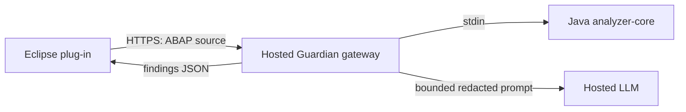

# Architecture

`Dockerfile` packages the gateway and Java analyzer into one service. Local
development may select Ollama instead of the hosted LLM.

## analyzer-core (Java 21, zero Eclipse deps)

Pipeline: `AbapTokenizer` → `AbapParser` → `RuleEngine` → JSON.

- **Tokenizer** — line-based, produces tokens with 1-based line/column and
  end positions. Understands `*` full-line comments, `"` inline comments,
  `"#` pseudo-comments, `'...'` and `` `...` `` literals (doubled-quote
  escapes), `|...|` string templates (brace-depth aware) and `##pragmas`.
- **Parser** — splits token stream into statements at periods, expands chain
  (colon) statements into separate statements sharing the prefix, and builds
  a block tree (LOOP/IF/CASE/TRY/CLASS/METHOD/…). SELECT…ENDSELECT loops are
  recognized by forward scan.
- **Rules** — 34 deterministic rules implemented against the statement/block
  model (never raw substring matching). Each returns `Finding` objects with
  all required fields and honest confidence values.
- **Engine** — applies YAML configuration (enable/disable, severity
  override, confidence threshold), collects suppressions
  (`"#EC ABAP_GUARDIAN: RULE reason="..."`, reason mandatory) and separates
  suppressed findings.
- **CLI** — `java -jar analyzer-core.jar <file|-> [config.yaml]` prints the
  result JSON; reads source from stdin when given `-` so callers never put
  source on the command line.

## ai-gateway (Python 3.12, FastAPI)

Endpoints: `GET /health`, `GET /api/v1/models`, `POST /api/v1/analyze`,
`POST /api/v1/chat`, `POST /api/v1/explain`, `POST /api/v1/suggest-fix`.

Invariants:
1. Deterministic analysis always runs first (via the analyzer CLI, source
   piped through stdin).
2. AI is optional and additive: it may improve explanation/recommendation/
   suggested code but can never add/remove findings or change positions.
   Replies are validated against Pydantic schemas; invalid output is dropped.
3. No source is stored or logged; tests prove it.
4. Limits are configurable via env: `MAX_SOURCE_LENGTH`, `AI_TIMEOUT_SECONDS`,
   `REQUEST_TIMEOUT_SECONDS`, `MAX_FINDINGS`, `MAX_TOKENS`.
5. External providers remain off unless both `LLM_PROVIDER=openai` and
   `ALLOW_EXTERNAL_PROVIDERS=true` are configured. Hosted Responses API calls
   use a server-side key, set `store: false`, and receive prompts only after
   `gateway/redaction.py` masks likely PII/credentials.
6. `KnowledgeProvider` protocol (`gateway/knowledge.py`) is the RAG seam.
   Hosted containers use `BundledKnowledgeProvider`, a dependency-free local
   lexical retriever over the repository's `docs/` and `rules/` files.
   `LocalVectorKnowledgeProvider` remains available for private deployments as
   a local vector store over a JSON index of Ollama-embedded rule docs and
   SAP best-practice notes (built by `scripts/build_knowledge_index.py` from
   `docs/rules.md` and `docs/knowledge/`). It activates when
   `KNOWLEDGE_INDEX_PATH` points at an index file; retrieval ranks by cosine
   similarity plus an exact rule-ID boost, degrades to rule-ID keyword
   matching when embeddings are unavailable, and returns nothing on a
   missing/corrupt index — the gateway works identically without it.
   Retrieved snippets are injected into chat/enhancement prompts *before* the
   redaction layer, so they are masked like everything else. No bundled
   knowledge is uploaded to a separate indexing service.

## Eclipse plug-in

- Public platform APIs only; nothing from `.internal` packages.
- Everything ADT-specific is isolated in
  `com.abapguardian.eclipse.adapter.AdtEditorAdapter`.
- Analysis and chat run in background `Job`s. `LiveAnalysisController`
  debounces editor changes, cancels stale work and supports an independent
  on-save trigger; both are disabled by default.
- Results appear in the findings view (Severity | Category | Rule | Line |
  Confidence | Title | Description | Suggestion) and as editor annotations.
- `CopilotView` is stacked next to Problems, keeps an in-memory bounded
  conversation and can include the active editor or selection as context.
- `GuardianStartup` reports service state and opens Welcome/What's New once
  for each installed bundle version.
- Suggested fixes are previewed in a compare dialog and applied only after
  explicit confirmation, as one document replace (single undo). The plug-in
  never saves or activates objects.
- The default proof-of-concept service URL is HTTPS and can be replaced with
  an organization-owned deployment. Provider credentials stay on the server.

## Wire format

`AnalysisResult` JSON: `objectName`, `objectType`, `findings[]`,
`suppressedFindings[]`. Each finding carries `ruleId`, `category`,
`severity`, `confidence`, `title`, `explanation`, `evidence`, `startLine`,
`startColumn`, `endLine`, `endColumn` (all 1-based), `recommendation`,
`suggestedCode`, `requiresHumanReview`, `documentationReferences`.

`POST /api/v1/chat` accepts `question`, optional `source`, `selection`, object
metadata and a bounded `history[]`; it returns `answer`, `model`,
`knowledgeReferences[]` and `contextIncluded`.
